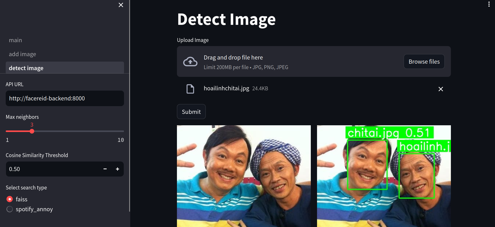
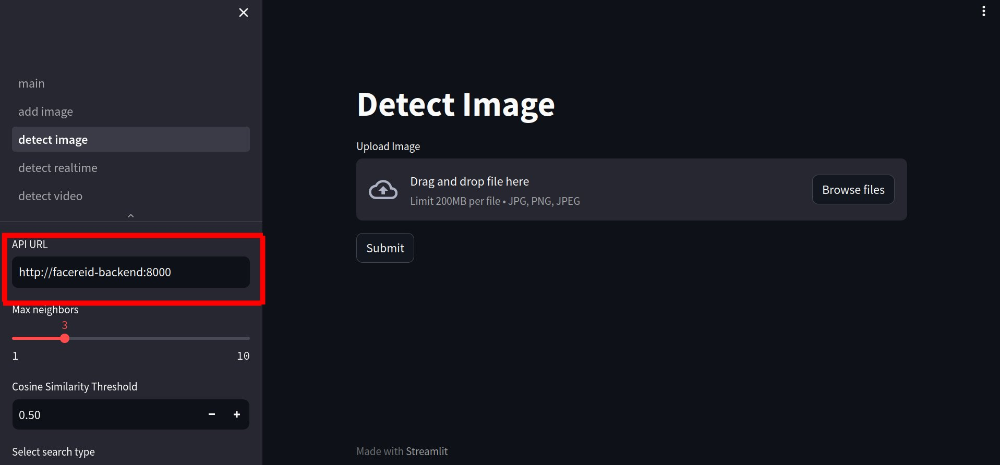

# FaceReIDTemplate
Template Streamlit and Requests for Face Re-Identification Projects



## Usage

1. Pull docker images:
    ```bash
    sudo docker pull -a  gallogun/facereid
    ```

2. Create bridge network:
    ```bash
    sudo docker network create testnet
    ```

3. Run backend container:
    ```
    sudo docker run --name facereid-backend --net testnet -p 8000:8000 gallogun/facereid:fastapi
    ```

4. Run frontend container and open the web URL:
    ```
    sudo docker run --name facereid-frontend --net testnet gallogun/facereid:streamlit
    ```
    If you cannot access to the streamlit website using URL from container output. Try access `http://localhost:8050` instead.

5. Fill the API URL input form by `http://facereid-backend:8000` as the above image.

    